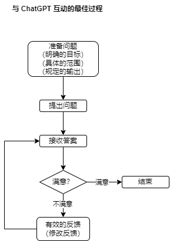

《ChatGPT 驱动软件开发：AI 在软件研发全流程中的革新与实践》读书笔记

## ChatGPT 使用说明

【1】获得高质量且合适的答案，提出问题前，确保所提出的问题满足以下几个要求：

- 明确的目标：清晰地阐述问题的目标，以便 ChatGPT 能够准确地理解并提供相应的信息或建议。

- 具体的范围：设定一个具体的范围，这有助于避免过于宽泛或模糊的回答，从而使答案更具针对性和实用性。

- 规定的输出：问题应该明确期望的答案格式和类型，例如，是否需要列举步骤、提供案例或者给出解决方案等。

【2】在 ChatGPT 给出建议性的答案之后，为了得到更为满意的结果，还需要继续进行以下步骤。

（1）足够的判断：在收到 ChatGPT 的回答后，仔细审阅并判断其是否符合预期，是否准确无误地解答了问题，以及是否包含了所有相关信息。
（2）有效的反馈：如果发现答案存在问题或需要补充，提供具体且明确的反馈，指出需要改进或补充的部分，这将有助于 ChatGPT 进一步优化答案。
（3）反复的迭代：通过多次与 ChatGPT 互动，不断完善问题和答案，以便最终获得高质量且合适的解答。

【3】人工智能 ChatGPT 可能无法完全理解某些问题或提供完美的答案，因此使用过程中要保持耐心并不断优化问题，将有助于提高互动体验和答案质量。

【4】遵循表 2：

| 步骤描述   | 示例或注意事项                                            |
| ---------- | --------------------------------------------------------- |
| 明确的目标 | 提问时明确说明目标，如“如何提高团队沟通效率”              |
| 具体的范围 | 设置问题范围，如“在远程工作环境中如何提高团队沟通效率”    |
| 规定的输出 | 期望的答案类型，如“请提供五个提高远程团队沟通效率的方法”  |
| 足够的判断 | 审阅答案，判断是否符合预期、准确无误且包含所有相关信息    |
| 有效的反馈 | 指出需要改进或补充的部分，如“请补充方法 3 的具体实施步骤” |
| 反复的迭代 | 与 ChatGPT 多次互动，优化问题和答案，直至获得满意的结果   |

【5】与 ChatGPT 互动的最佳过程：

1. 准备问题  
   （明确的目标）  
   （具体的范围）  
   （规定的输出）
2. 提出问题
3. 接收答案
4. 满意？  
   [满意] -> 结束。  
   [不满意] -> 有效的反馈（修改反馈），重复第 3、4 步。

## 目录【todo】
