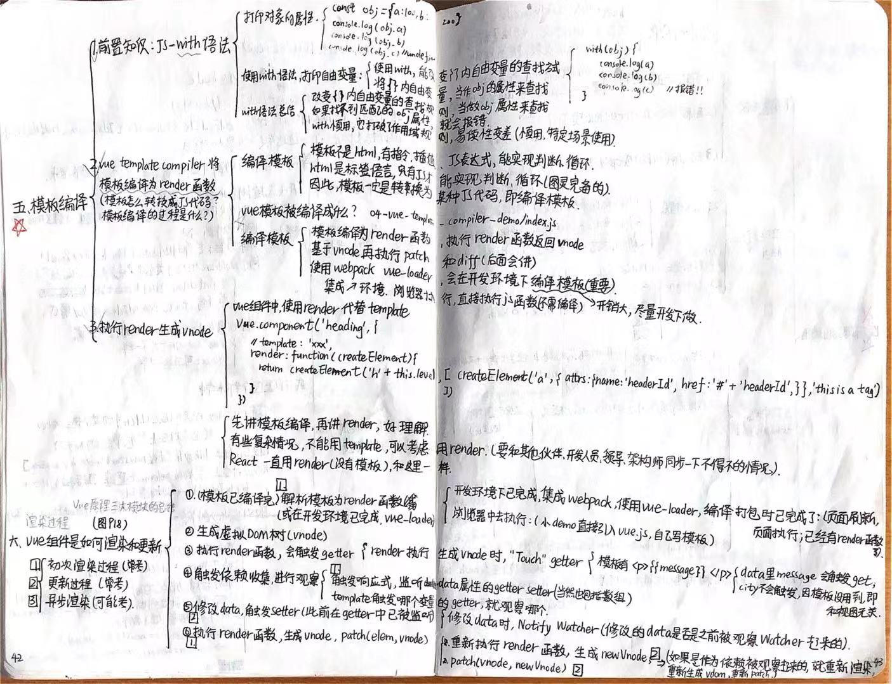

# 面试经验分享

截止今天 2024 年 12 月 10 日，面试了 x 次，把面试经验进行如下总结：

## 第一次/2022-3-10

### 笔试题：

- [ ] 按照要求写一个栈（当执行下列代码时，能输出预期的结果）

- [ ] 手写数组去重 unique

- [ ] 手写 fetchData

- [ ] 任选框架（React、Vue、Angular）实现一个 Message 组件，满足弹出消息通知、关闭消息通知即可

### 面试题：

- [x] TCP/IP 协议  
       https://juejin.cn/post/6908327746473033741#heading-72


- [x] HTTP 状态码  
       https://juejin.cn/post/6908327746473033741#heading-5  
       https://juejin.cn/post/6908327746473033741#heading-33

- [x] 常用状态码有哪些？用过哪些？


- [x] HTTPS 协议  
       https://juejin.cn/post/6908327746473033741#heading-24  
       https://juejin.cn/post/6844904073737535496#heading-22


- [x] 重绘重排  
       https://juejin.cn/post/6844904073737535496#heading-15


- [x] MVVM  
       https://juejin.cn/post/6919373017218809864#heading-5


- [x] Vue 原理  
       https://juejin.cn/post/6964779204462247950/#heading-30  
       https://juejin.cn/post/6919373017218809864#heading-2  
       [Vuex 原理](https://juejin.cn/post/6964779204462247950/#heading-16)





- [ ] 组件化开发思想

- [ ] 插槽

- [ ] event loop 机制  
       https://juejin.cn/post/6844904070579240974#heading-28

- [ ] Promise A+ 规范  
       [三、Promise A+ 规范](https://github.com/djsz3y/zhaowa-study-notes/blob/master/formal_lessons/js_2_fe_async_proc_specif_app.md#%E4%B8%89promise-a-%E8%A7%84%E8%8C%83)

- [ ] 手写 Promise  
       [二、简版 Promise](https://github.com/djsz3y/zhaowa-study-notes/blob/master/formal_lessons/js_2_fe_async_proc_specif_app.md#%E4%BA%8C%E7%AE%80%E7%89%88-promise)

- [ ] async/await、Promise、setTimeout 等打印输出

## 第二次/2024-4-3

> 先笔试
> 群面前手写算法
> 再群面，轮流问

### 1.笔试：

> 看平时积累

考察 CSS、JS 基础，Vue 原理，nodejs 等。

### 2.群面前：

手写两道算法题：

- [x] 删除有序数组中的重复项（双指针）：[26. 删除有序数组中的重复项](https://leetcode.cn/problems/remove-duplicates-from-sorted-array/)
- [ ] 异位字符（滑动窗口）：[438. 找到字符串中所有字母异位词](https://leetcode.cn/problems/find-all-anagrams-in-a-string/description/)

### 3.群面：

- [ ] em VS rem 区别（移动端）  
       https://juejin.cn/post/6941206439624966152#heading-25  
       https://juejin.cn/post/6844904077806190605#heading-21

       https://www.npmjs.com/package/postcss-viewport-units

- [ ] 1px 移动端应用（移动端）  
       https://juejin.cn/post/6941206439624966152#heading-37  
       https://juejin.cn/post/6844904077806190605#heading-14

- [ ] 闭包  
       https://juejin.cn/post/6844904070579240974#heading-40

- [ ] var let const 区别  
       https://juejin.cn/post/6844904070579240974#heading-13

- [ ] $nextTick  
       https://juejin.cn/post/6919373017218809864#heading-18

- [ ] Vue 生命周期  
       https://juejin.cn/post/6919373017218809864#heading-42

- [ ] VueRouter 生命周期  
       https://juejin.cn/post/6964779204462247950/#heading-2

- [ ] 懒加载 VS 预加载

- [ ] EventBus  
       https://juejin.cn/post/6919373017218809864#heading-52

- [ ] 垂直居中的实现方式  
       https://juejin.cn/post/6905539198107942919#heading-38

### 4.其他候选人会的

- 移动端
- 小程序
- 地图 Echarts/G3
- CSS 动画

## 第三次/2024-4-8

> 属于 HR 面试

- [ ] 问工作经验，
- [ ] 问离职原因，
- [ ] 问空窗期，
- [ ] 问为什么来北京，
- [ ] 问未来职业规划，
- [ ] 问能否落地，
- [ ] 问家庭，
- [ ] 问学校成绩排名，
- [ ] 问为什么选这个专业，
- [ ] 顾虑能否跟上工作强度。
- [x] 你的优势是什么

## 第四次/2024-4-9

> 大部分是手写代码，考察 JS 基础比较多

1. [ ] CSS 基础题：手写 flex 布局  
        https://juejin.cn/post/6905539198107942919#heading-40

2. [ ] CSS 基础题：CSS 伪类/伪元素是什么，并举例  
        https://juejin.cn/post/6941206439624966152#heading-7  
        https://juejin.cn/post/6905539198107942919#heading-10

伪类和伪元素是 CSS 中用来选择元素的特殊方式，它们允许你选择文档中的某些部分，而不是仅仅根据它们的名称或属性来选择。它们在 CSS 中起到了非常重要的作用，可以帮助你对文档中的元素进行更加精确和灵活的样式控制。

伪类（Pseudo-class）： 伪类是用于向某些选择器添加特殊效果的关键字，它们在选择器的末尾，以冒号（:）为前缀。伪类用于向特定状态的元素应用样式，例如鼠标悬停、被点击等状态。

举例：

```css
/* 鼠标悬停时改变链接的颜色 */
a:hover {
  color: red;
}

/* 将第一个子元素的背景色设置为灰色 */
div:first-child {
  background-color: gray;
}
```

伪元素（Pseudo-element）： 伪元素允许你为某些元素的特定部分添加样式，而不是仅仅对整个元素进行样式设置。伪元素在选择器的末尾，以双冒号（::）为前缀。

举例：

```css
/* 在段落的第一个行之前添加内容 */
p::first-line {
  font-weight: bold;
}

/* 在段落的末尾添加内容 */
p::after {
  content: ' - The End';
}
```

这些只是伪类和伪元素的一些基本示例，它们可以根据需要进行更加复杂和灵活的使用。伪类和伪元素为 CSS 提供了强大的选择器功能，使得我们能够以更精确的方式控制文档中的元素样式。

3. [ ] JS 基础题：遍历对象，至少两种方法（考察对象遍历方式，考察可迭代对象）

4. [ ] 手写代码：考察：数字千分位，对值类型、引用类型的理解

5. [x] 手写代码：回文（双指针）：  
        [9. 回文数](https://leetcode.cn/problems/palindrome-number/description/)  
        [9.回文数-我的算法做题仓库](https://github.com/djsz3y/algorithm-labuladong/blob/master/9.%E5%9B%9E%E6%96%87%E6%95%B0.js)

6. [ ] 打印输出：async/await Promise setTimeout 等顺序问题（考察同步、异步、宏任务、微任务等事件循环机制 event loop 的理解）

7. [ ] 手写代码：树扁平化/树转数组 treeToList 扁平化并根据 id 排序（可用 flatMap）

## 电话面试（2024-4-22）

### Vue2 VS Vue3 的区别

### 组件传值的方式

### css 选择器

第一优先级：!important 会覆盖页面内任何位置的元素样式 1.内联样式，如 style="color: green"，权值为 1000
2.ID 选择器，如#app，权值为 0100 3.类、伪类、属性选择器，如.foo, :first-child, div[class="foo"]，权值为 0010 4.标签、伪元素选择器，如 div::first-line，权值为 0001 5.通配符、子类选择器、兄弟选择器，如\*, >, +，权值为 0000 6.继承的样式没有权值

作者：卷帘依旧
链接：https://juejin.cn/post/6844904159305531406
来源：稀土掘金
著作权归作者所有。商业转载请联系作者获得授权，非商业转载请注明出处。

> [面试官：css 选择器有哪些？优先级？哪些属性可以继承？](https://github.com/febobo/web-interview/issues/95)

#### 伪类选择器

      :link ：选择未被访问的链接
      :visited：选取已被访问的链接
      :active：选择活动链接
      :hover ：鼠标指针浮动在上面的元素
      :focus ：选择具有焦点的
      :first-child：父元素的首个子元素

#### 伪元素选择器

      :first-letter ：用于选取指定选择器的首字母
      :first-line ：选取指定选择器的首行
      :before : 选择器在被选元素的内容前面插入内容
      :after : 选择器在被选元素的内容后面插入内容

### 如何改变 this 指向

- [ ] [二、手写 call 和 apply & 三、手写 bind](https://github.com/djsz3y/zhaowa-study-notes/blob/master/formal_lessons/js_1_advanced_usage_2.md#%E4%BA%8C%E6%89%8B%E5%86%99-call-%E5%92%8C-apply)

# 笔试

- [x] 经典 async await 笔试题：考察 Promise async await 异步 事件循环机制等知识点的理解（能做出来）

- [ ] 实战题：做个项目出来

# 线上面试/2024-12-9

- [x] 算法：[14.最长公共前缀](https://leetcode.cn/problems/longest-common-prefix/)  
      https://github.com/djsz3y/algorithm-labuladong/blob/master/14.%E6%9C%80%E9%95%BF%E5%85%AC%E5%85%B1%E5%89%8D%E7%BC%80.js
      
12.11

- [ ] HMR 原理


- [ ] 自己重新做个项目需要多久

## 需要改进的地方

- [ ] [ES6 入门教程](https://es6.ruanyifeng.com/)

其中，看完：4 到 11 章

12.11

- [ ] 计时：自己重新做个项目需要多久

- [ ] 刷题：力扣简单题

9 14

- [ ] 刷面试题

# 手写上述

# 友情链接

- [掘金](https://juejin.cn/user/1042768423037150)

- [github](https://github.com/djsz3y)

- [读书/视频/笔记](https://github.com/djsz3y/learning-notes)

- [学习笔记](https://github.com/djsz3y/zhaowa-study-notes)

- [bug 仓库](https://github.com/djsz3y/bug-repository)
