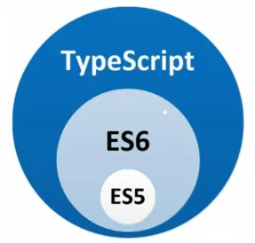

# TypeScript 入门教程学习（一）

## 常见面试题

- TS 有哪些基本类型
- `void` 和 `undefined` 的区别
- `unknow` 与 `any` 类型的区别
- `never` 类型有了解吗？TS 最底层的类型是什么？

## TypeScript 介绍

- 微软开源编程语言
- `JS` 超集，遵循 `ES6+` 规范，拓展了 `JS` 语法
- 更像后端 `Java` `C#` 面向对象语言，让 `JS` 可以开发大型企业项目。
- 谷歌大力支持 `TS` 推广
- 最新 `Vue` `React` 集成 `TypeScript` 。



## 设计理念

- [官方 TS 设计理念介绍](https://github.com/Microsoft/TypeScript/wiki/TypeScript-Design-Goals)

## 安装使用

[1]全局安装 ts：

```bash
npm install -g typescript
```

[2]生成 `tsconfig.json` 配置文件：

```bash
tsc --init
```

[3]编译 ts 文件，生成 js 文件

```bash
tsc helloworld.ts
```

[4]ts 在线编译：

- [菜鸟工具：TypeScript 在线工具](https://www.jyshare.com/compile/5577/)

[5]运行和断点调试：

[5.1]安装 `ts-node`：

```bash
npm install ts-node
```

[5.2]运行 TS：

```bash
npx ts-node helloworld.ts
```

[5.3]只能编辑器里调试，跟 JS 一样。

- VSCode 点击右上角的 `运行和调试` ——> `JavaScript 调试终端`

## 编辑器实时编译

### webstorm

[1]打开 `Preferences` > `Languages & Frameworks` > TypeScript 配置如下


[2]弹窗右下角 OK，生成 hello world.js


### vscode 配置

点击菜单 任务-运行任务 点击 tsc: 监视-tsconfig.json 然后就可以自动生成代码了。


## 为什么要使用 TypeScript

### 1.TypeScript 增加了系统的可读性和可维护性

1. **类型检查**是最好的文档

2. **编译阶段**就发现大部分错误

3. 增强了**编辑器和 IDE** 的功能，包括代码补全、接口提示、跳转到定义、重构等

### 2.Typescript 非常包容

> - 超集
> - 类型推论
> - 一切类型
> - 编译报错
> - 第三方库

1. TypeScript 是 JavaScript 的超集， `.js` 文件可以直接重命名为 `.ts` 即可。

2. 即使不显示的定义类型，也能够自动做出类型推论

3. 可以定义从简单到复杂的几乎一切类型

4. 即使 `TypeScript` 编译报错，也可以生成 `JavaScript` 文件

5. 兼容第三方库，即使第三方库不是用 `TypeScript` 写的，也可以编写单独的类型文件供 `TypeScript` 读取

### 3.TypeScript 拥有活跃的社区

1. 大部分第三方库都有提供给 TypeScript 的类型定义文件

2. Google 开发的 `Angular2` 就是使用 `TypeScript` 编写的

3. `TypeScript` 拥抱了 `ES6` 规范，也支持部分 `ESNext` 草案的规范

## TypeScript 的缺点

1. 有一定的学习成本，需要理解接口（`Interfaces`）、泛型（`Generics`）、类（`Classes`）、枚举类型（`Enums`）等前端工程师可能不是很熟悉的概念

2. 短期可能会增加一些开发成本，毕竟要多写一些类型的定义，不过对于一个需要长期维护的项目，`TypeScript` 能够减少其维护成本

3. 集成到构建流程需要一些工作量

4. 可能和一些库结合的不是很完美

## Typescript 特性

[1]静态类型（编译时还是运行时进行类型检查）

[2]弱类型（是否允许隐式类型转换）

[3]IDE 代码补全和接口提示等功能

- 一些第三方库原生支持了 TypeScript，在使用时就能获得代码补全了，比如 `Vue 3.0`
- 如果三方库原生不支持 `TypeScript`，以通过安装社区维护的类型声明库 比如 `npm install --save-dev @types/react`

[4]完全兼容 JavaScript 的，它不会修改 JavaScript 运行时的特性。

[5]可以编译为 `JavaScript`

[6]配置丰富，类型检查的严格程度由你决定

[7]`TypeScript` 与标准同步发展

## TypeScript 中的原始数据类型

- 与 JS 中 原始类型相对应 `boolean`、`number`、`string`、`null`、`undefined`、`Symbol`、`BigInt`

- 包装类型也与 JS 对应（包装类型不是原始类型）

- `void`

- `any`

- `unknow`

- `never`

## `boolean` `number` `string`

1. 即使不显式的定义类型，也能够自动做出类型推论

2. 声明未赋值等价于 自动推断为 `any` 类型

```ts
// 1.不显式的定义类型，也能够自动做出类型推论
let age = 1 // let age: number

age = 'zhangsan' // 报错 不能将类型“string”分配给类型“number”。ts(2322)

// 2.声明未赋值 自动推断为any类型
let person // let person: any
```

补充知识点：类型推论

`TypeScript` 会在没有明确的指定类型的时候推测出一个类型，这就是类型推论。

例如 `let age = 1` 会自动推断为 `age: number`

## 包装对象

JS 中存在包装对象的概念。

当你使用原始类型（字符串、数字、boolean 值）调用属性或方法时，JS 会创建一个临时的包装对象，使你能够访问可操作原始数据类型的属性和方法。这个过程称为自动包装。

在 `TS` 中也存在包装对象

- 原始类型兼容对应的对象包装类型，对象类型不兼容对应的原始类型。（子类可以赋值给父类，反之不行，原始类型是父类）

```ts
var str = 'Hello'
var strObject = new String(str) // 创建一个字符串包装对象
console.log(strObject.length) // 访问字符串的长度属性
console.log(str.length) // 访问字符串的长度属性

// 在 TS 中也存在包装对象
// 报错 Type 'Boolean' is not assignable to type 'boolean'.
let createdByNewBoolean: boolean = new Boolean(1)
```

## `null` 和 `undefined`

与 void 的区别是：

- `undefined` 和 `null` 是所有类型的子类型

- 也就是说 `undefined` 类型的变量，可以赋值给其他类型的变量（未指定 `strictNullChecks` 时）

```ts
// 这样不会报错
let num: number = undefined

let u: void
let num2: number = u // 不能将类型“void”分配给类型“number”。ts(2322)
```

注意：

`tsconfig.json` 指定了 `"strictNullChecks": true`，`null` 和 `undefined` 只能赋值给 `any`、`unknown` 和它们各自的类型，`undefined` 可以赋值给 `void` 类型。

## 空值 `void`【针对函数的】

> JS 中 `void` 是一个运算符，表示忽略表达式的返回值，或者返回值是 `undefined`
> JS 函数总是返回一些东西，没有返回值即返回 `undefined`

- 在 TS 中可以用 `void` 表示没有任何返回值的函数，它是 `undefined` 的父类型

- 未定义返回值自动推断为 `void` 类型

- 可以将 `undefined` 和 `null` 赋值给 `void` 类型（未指定 `strictNullChecks`时）

void 时没有返回值的函数的类型，是 undefined 的父类行

### 总结：

1. JS 函数总是返回一些东西；

2. 一个函数未定义返回值，自动推断为 `void` 类型；

3. `void` 类型是 `undefined` 的父类型；

4. 未指定 `strictNullChecks` 时，可以将 `undefined` 和 `null` 赋值给 void 类型；

### ⭐ 举例

```ts
// 未定义返回值自动推断为 void 类型
function alertName() {
  alert('My name is Tom')
}
var showAlert = alertName() // var showAlert: void
// null 和 undefined 可以赋值给 void
let unusable: void = undefined
```

### ⭐TS 既然有了 `undefined` 为什么还需要 `void` 呢？区别是什么？<span style="color:red;">【不理解】</span>

区别在于：

- **作为返回类型的 void 可以用不同的类型替换，以允许高级回调模式**

```ts
function doSomething(callback: () => void) {
  let c = callback() // 此时 c 为 void 类型
}

// 返回 number 类型
function aNumberCallback(): number {
  return 2
}

doSomething(aNumberCallback)
```

## `any`【针对未定义的变量的】

TS 新手超级喜欢这个类型

- 任意值（Any）用来表示允许赋值为任意类型。
- 它允许访问任意属性和调用任意方法 因此 `any` 成了系统的顶级类型

```ts
// 但如果是 any 类型，则允许被赋值为任意类型。
let myFavoriteNumber: any = 'seven'
myFavoriteNumber = 7

// 在任意值上访问任何属性都是允许的：
console.log(myFavoriteNumber.logName)
// 也允许调用任何方法：
myFavoriteNumber.split('')

// 声明未赋值 推断为 any
let any1 // any1: any
```

## `unknown`

### 【1】与 `any` 的相同点：

- 都是 TypeScript 的顶层类型，所有类型都可以分配给 `unknown`

### 【2】与 `any` 的不同点：

1. 针对 `unknown` 类型，必须先缩小类型，才能对它执行任意操作，使用它的方法和属性。

2. `unknown` 类型只能被赋值给 `any` 类型和 `unknown` 类型本身。

（针对第一点）：

### 【3】缩小未知类型的范围的三种方法：

1. 类型断言

2. `typeof`

3. `is` 关键字

### 举例

```ts
let unknownVal: unknown = 'str'
unknownVal = true // 所以所有类型都可以分配给 unknown——【1】与 `any` 的相同点：

// 2.unknown类型只能赋值给any类型和unknown类型——【2】与 `any` 的不同点：
let anyVal: any
anyVal = unknownVal
let num: number = 12
num = unknownVal // 不能将类型“unknown”分配给类型“number”。ts(2322)

/* 【3】缩小未知类型的范围的三种方法： */
// 类型断言
function toFixed(value: unknown) {
  return (value as number).toFixed(2)
}

// typeof 类型保护
function toFixed2(value: unknown) {
  if (typeof value === 'number') {
    return value.toFixed(2)
  }
}

// is 自定义类型保护
const isNumber = (val: unknown): val is number => typeof val === 'number'
function toFixed3(value: unknown) {
  if (isNumber(value)) {
    return value.toFixed(2)
  }
}
```

## `never` 类型

- never 类型表示的是那些永不存在的值的类型，这意味着，定义了一个 never 类型，只能被 never 类型的值所赋值

- never 是 undefined 和 null 的子类型，是最底层的类型

### 什么情况下会出现 never 类型

一个从来不会有返回值的函数：

```ts
let ne = (() => {
  while (true) {}
})()
```

一个总是会抛出错误的函数：

```ts
let ne2 = (() => {
  throw new Error('异常')
})()
```

## 类型进阶

> 联合类型
> 对象的类型
> 数组的类型
> 函数的类型
> 元组类型

### 联合类型

- 联合类型（Union Types） 表示取值可以为多种类型中的一种
- 只能访问此联合类型的所有类型里共有的属性或方法

```ts
let myFavoriteNumber: string | number
myFavoriteNumber = 'seven'
myFavoriteNumber = 7

function getLength(something: string | number): string {
  console.log(something.length) // 不可以number类型没有length属性
  console.log(something.toFixed(2)) // 不可以，string类型没有toFixed方法
  return something.toString()
}
```

### 对象的类型

> 思路：  
> 对象的类型-接口-行为的抽象-首字母大写-不允许实例多/少一些属性-属性修饰-可选?/只读 readonly 属性-任意属性 `[propName: string]: any;`

在 TypeScript 中，我们使用**接口**（Interfaces）来定义**对象的类型**。

1. 何为**接口**？它是**对行为的抽象**。

2. 接口一般**首字母大写**。有的编程语言中会建议接口的名称加上 `I` 前缀。
3. 接口定义后，实例多一些属性或少一些属性都是不允许的
4. 属性修饰 `?` 可选属性 `readonly` 只读属性
5. 任意属性 `[propName: string]: any;`：  
   一旦定义了任意属性，那么确定属性和可选属性都必须是它的类型的子集。

```ts
interface Person {
  name: string
  age: number
}
let tom: Person = {
  // 报错 缺少age属性
  name: 'Tom'
}
let tom2: Person = {
  // 报错 不需要 gender 属性
  name: 'Tom',
  age: 25,
  gender: 'male'
}
// ---
interface Person2 {
  readonly name: string
  age?: number
  // [propName: string]: string; // 报错，任意类型必须包含可选类型和确定类型
  [propName: string]: string | number | undefined
}
let jack: Person2 = {
  name: 'zs'
}
jack.name = 'ls' // 报错
jack.age = 12 // ok
jack.sex = 1 // ok

// ---
// ⭐只读的约束存在于第一次给对象赋值的时候，而不是第一次给只读属性赋值的时候
interface Person3 {
  readonly id?: number
  name: string
  age?: number
  [propName: string]: any
}
let tom3: Person3 = {
  name: 'Tom',
  gender: 'male'
}
tom3.id = 89757 // 报错
```

### 数组的类型

#### 数组的三种表示法

1. 类型+方括号 表示法

2. 泛型 表示法

3. 接口 表示法

```ts
let fibonacci: number[] = [1, 1, 2, 3, 5] // 类型+方括号 表示法
```

```ts
let fibonacci: Array<number> = [1, 1, 2, 3, 5] // 泛型 表示法
```

```ts
interface NumberArray {
  [index: number]: number
}
let fibonacci: NumberArray = [1, 1, 2, 3, 5] // 接口 表示法
```

#### 类数组

【1】类型 `IArguments` 缺少 类型 `number[]` 的以下属性：pop push concat join 以及其他 24 个属性。

```ts
function sum() {
  let args: number[] = arguments // 报错
}

// Type 'IArguments' is missing the following properties from type 'number[]': pop, push, concat, join, and 24 more.
```

【2】把 arguments 赋值给 args，给 args 设置 IArguments 类型，IArguments 是 TS 内置对象。

```ts
function sum() {
  let args: IArguments = arguments
}
// IArguments 是TS内置对象
// 实际 IArguments 定义如下
interface IArguments {
  [index: number]: any
  length: number
  callee: Function
}
```

【3】any[] 表示数组中允许出现任意类型，如下例子。

```ts
// 用 any 表示数组中允许出现任意类型
let list: any[] = ['xcatliu', 25, { website: 'xcatliu.com' }]
```

### 函数的类型

1. 约束函数参数类型、参数个数及返回值类型

2. 函数声明语句的 TS 修饰

3. 函数定义语句的 TS 修饰

4. 使用 interface 修饰函数

5. 对函数参数设置默认值，同样会进行类型推断

6. 可选修饰符：  
   -仅最后一个参数可以用 ?  
   -设置了默认值就不能使用可选修饰符

7. `readonly` 修饰参数，只能在构造函数中使用

8. 剩余参数，准许 JS 语法 只能在最后一个参数定义

9. 函数重载（完整的函数重载将在下一篇进阶课中讲解）

#### 【1】函数声明语句

```ts
// 函数声明语句
function sum(x: number, y: number): number {
  return x + y
}
sum(1) // 报错，不能少参数
sum(1, 2) // ok
```

#### 【2】函数定义表达式：

```ts
// 函数定义表达式
let mySum = function (x: number, y: number): number {
  return x + y
}

// 等同于如下代码
let mySum: (x: number, y: number) => number = function (
  x: number,
  y: number
): number {
  return x + y
}
```

#### 【3】使用 interface 修饰函数：

```ts
// 使用interface修饰函数
interface SearchFunc {
  (source: string, subString: string): boolean
}

let mySearch: SearchFunc
mySearch = function (source: string, subString: string) {
  return source.search(subString) !== -1
}
```

#### 【4】函数重载：

```ts
// 函数重载
function reverse(x: number): number // 重载签名
function reverse(x: string): string // 重载签名
// 实现签名
function reverse(x: number | string): number | string | void {
  if (typeof x === 'number') {
    return Number(x.toString().split('').reverse().join(''))
  } else if (typeof x === 'string') {
    return x.split('').reverse().join('')
  }
}
```

### 元组类型

数组合并了相同类型的对象，而元组（Tuple）合并了不同类型的对象

- 访问已知索引的元素会得到正确的类型
- 添加越界的元素时，它的类型会被限制为元组中每个类型的联合类型

```ts
// 元组的定义
let tom4: [string, number] = ['Tom', 25]
let tom5: [string, number]
// tom5 = [25, 'Tom'] // 报错
tom5 = ['Tom', 25]
tom5[0] = 'Tom' // 可以只赋值其中一项：
// 当赋值或访问一个已知索引的元素时，会得到正确的类型：
tom4[0].slice(1)
tom4[1].toFixed(2)

// 当添加越界的元素时，它的类型会被限制为元组中每个类型的联合类型：
tom4.push('male') // ok
tom4.push(true) // 报错
```

# 实践

## 项目初始化

```bash
npm init
```

> package.json

```json
{
  "name": "ts-study",
  "version": "1.0.0",
  "description": "",
  "main": "index.js",
  "scripts": {
    "test": "echo \"Error: no test specified\" && exit 1"
  },
  "author": "",
  "license": "ISC"
}
```

## 生成 ts 配置文件

```bash
tsc --init

Created a new tsconfig.json with:

  target: es2016
  module: commonjs
  strict: true
  esModuleInterop: true
  skipLibCheck: true
  forceConsistentCasingInFileNames: true

You can learn more at https://aka.ms/tsconfig
```

> tsconfig.json

```json
{
  "compilerOptions": {
    /* Visit https://aka.ms/tsconfig to read more about this file */

    /* Projects */
    // "incremental": true,                              /* Save .tsbuildinfo files to allow for incremental compilation of projects. */
    // "composite": true,                                /* Enable constraints that allow a TypeScript project to be used with project references. */
    // "tsBuildInfoFile": "./.tsbuildinfo",              /* Specify the path to .tsbuildinfo incremental compilation file. */
    // "disableSourceOfProjectReferenceRedirect": true,  /* Disable preferring source files instead of declaration files when referencing composite projects. */
    // "disableSolutionSearching": true,                 /* Opt a project out of multi-project reference checking when editing. */
    // "disableReferencedProjectLoad": true,             /* Reduce the number of projects loaded automatically by TypeScript. */

    /* Language and Environment */
    "target": "es2016" /* Set the JavaScript language version for emitted JavaScript and include compatible library declarations. */,
    // "lib": [],                                        /* Specify a set of bundled library declaration files that describe the target runtime environment. */
    // "jsx": "preserve",                                /* Specify what JSX code is generated. */
    // "experimentalDecorators": true,                   /* Enable experimental support for legacy experimental decorators. */
    // "emitDecoratorMetadata": true,                    /* Emit design-type metadata for decorated declarations in source files. */
    // "jsxFactory": "",                                 /* Specify the JSX factory function used when targeting React JSX emit, e.g. 'React.createElement' or 'h'. */
    // "jsxFragmentFactory": "",                         /* Specify the JSX Fragment reference used for fragments when targeting React JSX emit e.g. 'React.Fragment' or 'Fragment'. */
    // "jsxImportSource": "",                            /* Specify module specifier used to import the JSX factory functions when using 'jsx: react-jsx*'. */
    // "reactNamespace": "",                             /* Specify the object invoked for 'createElement'. This only applies when targeting 'react' JSX emit. */
    // "noLib": true,                                    /* Disable including any library files, including the default lib.d.ts. */
    // "useDefineForClassFields": true,                  /* Emit ECMAScript-standard-compliant class fields. */
    // "moduleDetection": "auto",                        /* Control what method is used to detect module-format JS files. */

    /* Modules */
    "module": "commonjs" /* Specify what module code is generated. */,
    // "rootDir": "./",                                  /* Specify the root folder within your source files. */
    // "moduleResolution": "node10",                     /* Specify how TypeScript looks up a file from a given module specifier. */
    // "baseUrl": "./",                                  /* Specify the base directory to resolve non-relative module names. */
    // "paths": {},                                      /* Specify a set of entries that re-map imports to additional lookup locations. */
    // "rootDirs": [],                                   /* Allow multiple folders to be treated as one when resolving modules. */
    // "typeRoots": [],                                  /* Specify multiple folders that act like './node_modules/@types'. */
    // "types": [],                                      /* Specify type package names to be included without being referenced in a source file. */
    // "allowUmdGlobalAccess": true,                     /* Allow accessing UMD globals from modules. */
    // "moduleSuffixes": [],                             /* List of file name suffixes to search when resolving a module. */
    // "allowImportingTsExtensions": true,               /* Allow imports to include TypeScript file extensions. Requires '--moduleResolution bundler' and either '--noEmit' or '--emitDeclarationOnly' to be set. */
    // "resolvePackageJsonExports": true,                /* Use the package.json 'exports' field when resolving package imports. */
    // "resolvePackageJsonImports": true,                /* Use the package.json 'imports' field when resolving imports. */
    // "customConditions": [],                           /* Conditions to set in addition to the resolver-specific defaults when resolving imports. */
    // "resolveJsonModule": true,                        /* Enable importing .json files. */
    // "allowArbitraryExtensions": true,                 /* Enable importing files with any extension, provided a declaration file is present. */
    // "noResolve": true,                                /* Disallow 'import's, 'require's or '<reference>'s from expanding the number of files TypeScript should add to a project. */

    /* JavaScript Support */
    // "allowJs": true,                                  /* Allow JavaScript files to be a part of your program. Use the 'checkJS' option to get errors from these files. */
    // "checkJs": true,                                  /* Enable error reporting in type-checked JavaScript files. */
    // "maxNodeModuleJsDepth": 1,                        /* Specify the maximum folder depth used for checking JavaScript files from 'node_modules'. Only applicable with 'allowJs'. */

    /* Emit */
    // "declaration": true,                              /* Generate .d.ts files from TypeScript and JavaScript files in your project. */
    // "declarationMap": true,                           /* Create sourcemaps for d.ts files. */
    // "emitDeclarationOnly": true,                      /* Only output d.ts files and not JavaScript files. */
    // "sourceMap": true,                                /* Create source map files for emitted JavaScript files. */
    // "inlineSourceMap": true,                          /* Include sourcemap files inside the emitted JavaScript. */
    // "outFile": "./",                                  /* Specify a file that bundles all outputs into one JavaScript file. If 'declaration' is true, also designates a file that bundles all .d.ts output. */
    // "outDir": "./",                                   /* Specify an output folder for all emitted files. */
    // "removeComments": true,                           /* Disable emitting comments. */
    // "noEmit": true,                                   /* Disable emitting files from a compilation. */
    // "importHelpers": true,                            /* Allow importing helper functions from tslib once per project, instead of including them per-file. */
    // "importsNotUsedAsValues": "remove",               /* Specify emit/checking behavior for imports that are only used for types. */
    // "downlevelIteration": true,                       /* Emit more compliant, but verbose and less performant JavaScript for iteration. */
    // "sourceRoot": "",                                 /* Specify the root path for debuggers to find the reference source code. */
    // "mapRoot": "",                                    /* Specify the location where debugger should locate map files instead of generated locations. */
    // "inlineSources": true,                            /* Include source code in the sourcemaps inside the emitted JavaScript. */
    // "emitBOM": true,                                  /* Emit a UTF-8 Byte Order Mark (BOM) in the beginning of output files. */
    // "newLine": "crlf",                                /* Set the newline character for emitting files. */
    // "stripInternal": true,                            /* Disable emitting declarations that have '@internal' in their JSDoc comments. */
    // "noEmitHelpers": true,                            /* Disable generating custom helper functions like '__extends' in compiled output. */
    // "noEmitOnError": true,                            /* Disable emitting files if any type checking errors are reported. */
    // "preserveConstEnums": true,                       /* Disable erasing 'const enum' declarations in generated code. */
    // "declarationDir": "./",                           /* Specify the output directory for generated declaration files. */
    // "preserveValueImports": true,                     /* Preserve unused imported values in the JavaScript output that would otherwise be removed. */

    /* Interop Constraints */
    // "isolatedModules": true,                          /* Ensure that each file can be safely transpiled without relying on other imports. */
    // "verbatimModuleSyntax": true,                     /* Do not transform or elide any imports or exports not marked as type-only, ensuring they are written in the output file's format based on the 'module' setting. */
    // "allowSyntheticDefaultImports": true,             /* Allow 'import x from y' when a module doesn't have a default export. */
    "esModuleInterop": true /* Emit additional JavaScript to ease support for importing CommonJS modules. This enables 'allowSyntheticDefaultImports' for type compatibility. */,
    // "preserveSymlinks": true,                         /* Disable resolving symlinks to their realpath. This correlates to the same flag in node. */
    "forceConsistentCasingInFileNames": true /* Ensure that casing is correct in imports. */,

    /* Type Checking */
    "strict": true /* Enable all strict type-checking options. */,
    // "noImplicitAny": true,                            /* Enable error reporting for expressions and declarations with an implied 'any' type. */
    // "strictNullChecks": true,                         /* When type checking, take into account 'null' and 'undefined'. */
    // "strictFunctionTypes": true,                      /* When assigning functions, check to ensure parameters and the return values are subtype-compatible. */
    // "strictBindCallApply": true,                      /* Check that the arguments for 'bind', 'call', and 'apply' methods match the original function. */
    // "strictPropertyInitialization": true,             /* Check for class properties that are declared but not set in the constructor. */
    // "noImplicitThis": true,                           /* Enable error reporting when 'this' is given the type 'any'. */
    // "useUnknownInCatchVariables": true,               /* Default catch clause variables as 'unknown' instead of 'any'. */
    // "alwaysStrict": true,                             /* Ensure 'use strict' is always emitted. */
    // "noUnusedLocals": true,                           /* Enable error reporting when local variables aren't read. */
    // "noUnusedParameters": true,                       /* Raise an error when a function parameter isn't read. */
    // "exactOptionalPropertyTypes": true,               /* Interpret optional property types as written, rather than adding 'undefined'. */
    // "noImplicitReturns": true,                        /* Enable error reporting for codepaths that do not explicitly return in a function. */
    // "noFallthroughCasesInSwitch": true,               /* Enable error reporting for fallthrough cases in switch statements. */
    // "noUncheckedIndexedAccess": true,                 /* Add 'undefined' to a type when accessed using an index. */
    // "noImplicitOverride": true,                       /* Ensure overriding members in derived classes are marked with an override modifier. */
    // "noPropertyAccessFromIndexSignature": true,       /* Enforces using indexed accessors for keys declared using an indexed type. */
    // "allowUnusedLabels": true,                        /* Disable error reporting for unused labels. */
    // "allowUnreachableCode": true,                     /* Disable error reporting for unreachable code. */

    /* Completeness */
    // "skipDefaultLibCheck": true,                      /* Skip type checking .d.ts files that are included with TypeScript. */
    "skipLibCheck": true /* Skip type checking all .d.ts files. */
  }
}
```

## 编译 ts 生成 js

```ts
tsc helloworld.ts
```

在线编译网址：[菜鸟工具-TypeScript 在线工具](https://www.jyshare.com/compile/5577/)

## 运行和断点调试

[1]安装 `ts-node`

```bash
npm install ts-node
```

[2]运行 TS

```bash
npx ts-node helloword.ts
# 1
```

[3]调试只能在编辑器里调试，跟 JS 调试一样（VSCode 点击右上角的 `运行和调试` --> `JavaScript调试终端`）

- 在 VSCode 打开 ts-study 项目，  
  点击 `终端` -> `显示所有任务...` -> `tsc: 监视 - tsconfig.json`


# 参考链接

- [TypeScript 入门教程学习（一）](https://blog.warmplace.cn/post/ts_study#%E5%85%83%E7%BB%84)
