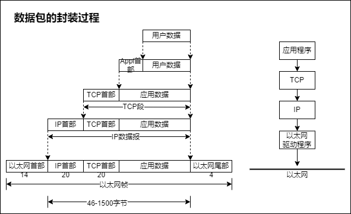

# 2-3 透过 TCP/IP 看 HTTP

[返回学习笔记目录](/README.md)

1. 为了理解 HTTP，我们有必要事先了解一下 TCP/IP 协议族。

2. 通常我们使用的网络包括互联网都是在我们的 TCP/IP 协议族的基础之上运作的；所以，HTTP 属于它内部的一个子集。

3. 所以理解一下 HTTP 所对应需要掌握的 TCP/IP 协议族的一些概要。

- HTTP 协议是构建在 TCP/IP 协议之上的，是 TCP/IP 协议的一个子集.

- 为了更好的理解 HTTP 协议，我们先了解一下 TCP/IP 的相关知识。

**TCP/IP 协议族**：

协议其实是一种规则。

- 计算机与网络设备要相互通信，双方必须基于相同的方法。比如说，如何探测到通信目标，由哪一边先发起通信，使用哪种语言来进行通信，怎么样去结束通信；等等，这些规则都需要事先确定。
- 不同硬件、不同的操作系统之间的通信，所有的这一切都需要一种规则，我们就把这种规则称为协议。

那么：

- TCP/IP 协议其实是一系列与互联网相关联的协议集合起来的总称。
- 分层管理是 TCP/IP 协议的重要特征。  
  （而在 TCP/IP 协议族里，分层管理是它的一个非常重要的特征）

是怎么分层的呢？

## 1.分层管理（重要特性）——四层协议组成的系统：

TCP/IP 协议族是由一个四层协议组成的系统，这四层分别为：应用层、传输层、网络层、数据链路层（我们可以简单称为链路层）。

我们分别来看一下，我们自顶向下的来进行了解：

### 1.1.应用层（首先，来看一下应用层）

- 应用层一般是我们编写的应用程序，它决定了向用户提供的应用服务。
- 应用层可以通过系统调用与传输层（向下）进行通信。如：FTP、DNS、HTTP 等。

（比如说，我们比较常见的，通过 FTP 下载文件，很多同学公司内部都是在用 FTP，这个 FTP 也是我们的应用层级。那么，我们前边介绍过的 DNS，也是应用层。再有，我们的 HTTP 协议，更是我们应用层的上一层级。）

（那说完应用层，接下来说我们的传输层。）

### 1.2.传输层

- 传输层通过系统调用向应用层提供处于网络连接中的两台计算机之间的数据传输功能。
- 在传输层有两个性质不同的协议：TCP 和 UDP。

TCP 是面向连接的（TCP 虽然比较可靠，但因为需要建立连接，所以效率比较低），UDP 是无连接的（UDP 没有连接，所以它效率比较高；但同样的，因为没有建立连接，没有这样的校验机制，所以可靠性就稍微低一点）。

这是两种性质不同的协议，所以在正常使用中，我们使用哪种协议，是取决于你的场景来决定的。

再来，是网络层。

### 1.3.网络层（又叫网络互联层）

- 网络层用来处理在网络上流动的数据包，数据包是网络传输的最小数据单位。
- 该层规定了通过怎样的路径（传输路线）到达对方计算机，并把数据包传输、传送给对方。

与对方计算机之间通过多台计算机和网络设备来进行传输的时候，网络层，它所起到的作用，就是，在众多的选项之中，选择一条传输路线。

接下来就到了链路层。

### 1.4.链路层（又叫数据链路层、网络接口层，链路层是最常用的一种称呼）

- 链路层用来处理连接网络的硬件部分，包括控制操作系统、硬件设备驱动、NIC(Network Interface Card 网络适配器)以及光纤等物理可见部分。（包括控制操作系统、硬件设备驱动、NIC：网卡、光纤物理等等，还包括连接器等等，一切的传输媒介。）
- 硬件上的范畴均在链路层的作用范围之内。

那么，我们接下来聊一聊，数据封装的过程。

## 2.数据包的封装过程

（就是说，我们的上层协议的数据，到底是怎么样转变成为下层协议数据的呢？这就是通过我们的叫做封装来实现的。）

（应用程序、数据，在发布到我们的数据网络之前，会沿着这个协议栈，从上往下去进行传递；而每层协议都将在我们的上层协议的基础之上加上自己的头部信息；链路层呢还会加上尾部信息，以此来实现我们的所有层它的一个数据封装，最终为我们到达我们的网络提供所有的必要信息。这就是数据包的封装过程。）

那我们来看看它的一个传输的过程：

## 3.HTTP 数据传输过程

（
我们利用 TCP/IP 协议族进行网络传输通信的时候，会通过分层的顺序，与对方进行通信：发送端从应用层往下走，接收端从应用层向上走。
）

（
我们就用 HTTP 来举例说明：

首先啊，作为发送端的客户端，在应用层，也就是通过我们的 HTTP 协议，发出一个想看某个 web 页面的 http 请求；

接下来，为了传输方便，在传输层，就是我们的通过 TCP 协议，把应用层收到的数据，就是我们的 HTTP 的请求报文，进行分割，并且在各个报文上打上标记序号、端口号等等一系列的信息，发送到我们的网络层；

在网络层，也就是通过我们的 IP 协议，增加作为通讯目的地的 MAC 地址，然后转发给链路层；这样一来呢，发往网络的通信请求就准备齐全了；

接收端的服务器在链路层，接收到请求的数据，按顺序向上层发送，一直发送到应用层；当我们传输到应用层的时候，才算我们真真正正的接收到的由客户端发送过来的 http 请求。

那就像我们刚刚说的，发送端在层与层之间传输数据的时候，每经过一层，必定会打上一个该层所属的头部的信息；

反过来说，在接收端，就相反，在层与层之间传输数据的时候，每经过一层，都要把对应的头部信息、首部信息，给它消去；

这就是说我们的 http 数据通信到底是怎么样进行的，我们的封装是怎样实现的。
）

- 发送端发送数据时，数据会从上层传输到下层，且每经过一层都会被打上该层的头部信息。而接收端接收数据时，数据会从下层传输到上层，传输前会把下层的头部信息删除

TCP/IP 协议数据流示意图：

（接下来，我们就说一说，非常重要的，对于我们这样面向 TCP、面向连接的，这样的协议的方式，到底是怎样进行一个通讯过程的：）

## 4.传输层——TCP 三次握手

- 使用 TCP 协议进行通信的双方必须先建立连接，然后才能开始传输数据。为了确保连接双方可靠性，在双方建立连接时，TCP 协议采用了三次握手策略。

图里，
客户端 client 和 服务端 server 拥有三次连接，为什么要有这样的三次连接呢？我们来聊一聊三次连接所做的事情，我们先来说第一次握手。

1. **第一次握手**：客户端发送带有 SYN 标志的连接请求报文段，然后进入 SYN SEND 状态（发送完成的状态），等待服务端的确认。
2. **第二次握手**：服务端接收到客户端的 SYN 报文段后，需要发送 ACK 信息（发送一个 ACK 返回消息）对这个 SYN 报文段进行确认。同时，还要发送自己的 SYN 请求信息。（一方面接收到了，一方面还要再请求出去）服务端会将上述的信息放到一个报文段(SYN+ACK 报文段)中，一并发送给客户端，此时服务端将会进入 SYN RECV 状态。（然后服务端会把这个信息，放到一个报文段里一起再发回给客户端。）
3. **第三次握手**：客户端接收到服务端的 SYN+ACK 报文段后，会想服务端发送 ACK 确认报文段，这个报文段发送完毕后，客户端和服务端都进入 ESTABLISHED 状态，完成 TCP 三次握手。（客户端接收到了它的一个返回和它的一个请求，会再生成一个 ACK，再给他发回到服务端。这样我们的客户端和服务端都进入到了准备好的一个状态，完成了 TCP 的三次握手，可以开始进行数据传输了。）

## 5.三次握手的目的是什么？

（为什么两端要确认可以开始进行传输了，为什么非要经过三次握手？）

- 最根本的目的就是，客户端和通讯端（服务端）要进行连接，要确认双方都能够明确自己和对方的收发能力都是正常的。

所以第一次握手，客户端发送到了网络包，服务端收到了；这样，服务端就能够得出一个结论，客户端作为对方来说，它的发送能力是正常的，而我自己，我的接收能力是正常的。但是客户端什么也不知道，因为它只发送出去了请求；所以，服务端要给它一个确认，

...

第三次握手，是因为服务端只知道客户端发送能力和服务端的接收能力是正常，
