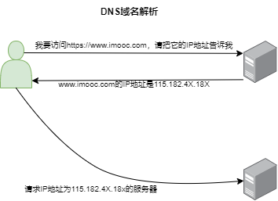

# 2-4-“你是如何访问慕课网的”--DNS 域名解析

## 你是如何访问慕课的”-DNS 域名解析

- 已经介绍了与 HTTP 协议有着密切关系的 TCP/IP 协议，接下
  来介绍的 DNS 服务也是与 HTTP 协议有着密不可分的关系。

- 通常我们访问一个网站，使用的是主机名或者域名来进行访问
  的。因为相对于 IP 地址（一组纯数字），域名更容易让人记住。
  但 TCP/IP 协议使用的是 IP 地址进行访问的，所以必须有个机制
  或服务把域名转换成 IP 地址。DNS服务就是用来解决这个问题
  的，它提供域名到 IP 地址之间的解析服务。

## 简要过程：

- 客户访问一个网址，域名首先到达 DNS 服务器，DNS 服务器首先把域名对应的 IP 地址返回给客户，通过这个 IP 地址才能够访问真正的网站所对应的 web 服务器。

## 微观：

DNS 服务解析是有层次的，就近原则。

本地电脑将经常使用的域名和响应的 IP 地址建立一个映射关系，并且保存到系统文件里；所以正常进行 DNS 域名解析时，系统优先从 host 文件里寻找对应的 IP 地址，如果找到，就直接使用 host 文件里的 IP 地址（毕竟这是最快的）；修改了 host 文件后，就把谷歌的地址指向了某一个 IP，这个 IP 可能是某一个镜像，可能是网上互联网的地址；这是做一个强制的 DNS 的转换，让我们能够把这个 IP 地址连接过去，因为 DNS 服务的解析先来读的就是系统的 host 文件。

其次，如果本地没有域名对应的 IP 地址映射，这时，就要求助于本地的 DNS 服务器，我们大家本地都有自己的一个 DNS 服务，大概就是，系统向本地的 DNS 服务器发送请求，去查询域名对应的 IP 地址，本地的 DNS 服务器响应请求，找到 IP 地址，并将结果返回给浏览器。

本地 DNS 服务是有限的。如果本地 DNS 服务器没有找到对应的 IP 地址，那么本地的 DNS 服务会一层一层的向上一级的 DNS 服务器发送请求，直到 DNS 根服务器如果找到的话，就会进行回传，最终把找到的 IP 地址返回给浏览器。

host 文件、本地 DNS、更高级的 DNS 服务器、根 DNS 服务器，目的就一个：把 DNS 服务器的服务做好，域名解析必须得有一个结果，要么给我一个 IP 地址，要么告诉我这个域名不存在，没有的话，就是域名错误，这样的一个情况。

## 所以再细致点，访问慕课网的真实情况是什么样的？

1. 浏览器里输入了慕课网的域名，操作系统会检查自己的本地的 host 文件是否有网址的映射关系，如果有就先调用这个 IP 进行映射；
2. 如果 host 没有这个域名映射，查找本地的 DNS 服务器，有直接返回，没有继续向下；
3. 如果 host 与本地 DNS 解析缓存都没有相应的网址的映射关系，那么首先，会在 TCP/IP 参数里设置首选的 DNS 服务器；
4. 大家记不记得配置网络的时候，经常会配置一个 DNS 服务器，那么我们会找那个首选的 DNS 服务器；
5. 比如经常用的就是 8.8.8.8，或者 114.114.114.114；在这叫它本地 DNS 服务器；那么这个服务器在收到查询的时候，如果要查询域名，包含在本地配置区域资源里面，就会返回给客户机；
6. 如果本地 DNS 服务器、本地区域文件的缓存解析都失效的话，那这时就根据本地的 DNS 服务器的设置，这里有一个设置：是否设置转发，进行查询；

如果没用转发模式，那本地 DNS 就直接把请求发到 13 台根 DNS；

如果你设置了话，就会一层一层向上去找；比如找慕课，就会一直向上直到找到 DNS，直到找到它的主机 IP；

如果用的是非转发模式，直接找 13 台根 DNS，然后一台一台去找，这样的一个模式。

## 举个例子：

小白打手机，脑子想-检查本地 host，手机通讯录-查询本地 DNS，
运营商服务点（移动营业厅）-首选 DNS 服务器，

打给中国运营商总公司查询，返回给楼下网点，楼下网点再告诉你——没用转发模式下，本地 DNS 直接把请求发到 13 台根 DNS

从这个网点向上找，找区营业厅、市营业厅、省营业厅，直到查询到最后一个最上面总营业厅——这就是向上一级、再上一级、再上一级 DNS 服务器进行转发；

这就是 DNS 整个服务的处理模式，简单来说就向现在看到的图一样，但是本身 DNS 服务器的解析还是有自己内在的逻辑的，而且还是相对比较复杂的；

宏观角度：只需要知道请求 DNS 服务器，DNS 服务器返回给我们相应的 IP 地址。

CDN 服务器&DNS 服务器

上海、深圳、新疆 都想看视频，访问慢，怎么办？
DNS 之上挂载 CDN，先由 CDN 进行内容分发，也就是它告诉我根据我自己的区域，来决定我应该访问到哪一边的服务器，然后再通过 DNS 服务器返回给我们，相对过程来说就是在 DNS 服务器上面，又增加了一个 CDN，这样的模式。
所以 CDN 和 DNS 不是一个东西，而且更不是取代的东西。
这就是 DNS 服务对于我们的意义。
我们发现 DNS 服务其实是整个 HTTP 协议、HTTP 服务的前置环节。
