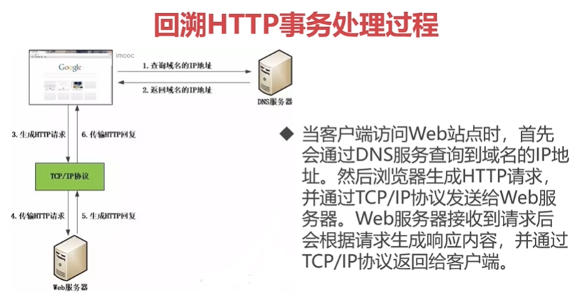
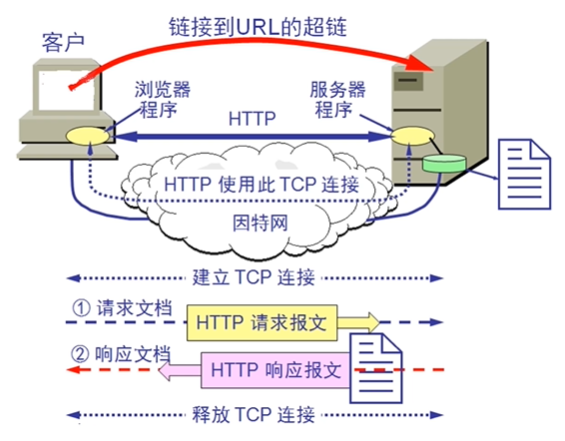

# 2-5-回溯 HTTP 事务处理过程

TCP/IP 协议、DNS 协议都有了一定的理解；

所以，在一开始的图之上有了新的理解；

### 所以整体的过程变成了这样：

1. 查询域名的 IP 地址
2. （由 DNS 服务器）返回域名的 IP 地址

3. 生成 HTTP 请求

TCP/IP 协议（通过 TCP/IP 协议族，需要进行连接，需要进行三次握手，）

4. 传输 HTTP 请求

5. 生成 HTTP 回复
6. 传输 HTTP 回复（再传输给我们的前端）

- 当客户端访问 Web 站点时，首先会通过 DNS 服务查询到域名的 IP 地址。然后浏览器生成 HTTP 请求，并通过 TCP/IP 协议发送给 Web 服务器。Web 服务器接收到请求后会根据请求生成响应内容，并通过 TCP/IP 协议返回给客户端。

### HTTP 事务处理完整过程

更完整的图：

HTTP 请求一个完整的工作方式/一个完整的事务处理过程。

更细致化一点：

如果我们用客户端浏览器浏览一个页面的话，那么我们就要从中分解出协议名、主机名、端口、对象路径等。

我们得到协议，我们用的是 HTTP 的协议，主机可能是慕课的主机，端口是 80 端口，对象路径是慕课的根节点；
在这一步，就需要通过 DNS 的服务器，DNS 服务解析出它的 IP 地址；

下一步是封装我们的 HTTP 请求的数据包，把以上部分结合本机自己的信息，封装成 HTTP 请求的数据包，再接下来，再把这个数据包向下；
HTTP 协议是最上层的应用层，再往下是传输层。所以我们把这个包再封装成 TCP 包，这样，我开始建立我们的 TCP 连接，这样就是 TCP 的三次握手，在 HTTP 开始工作之前，客户机首先要通过网络与服务器进行连接，这个连接就是 TCP 来完成的；这个协议与 IP 协议共同构建了我们整个的互联网，也就是前边说过的，TCP/IP 协议族，所以我们的互联网也有人称作，TCP/IP 网；
HTTP 因为是比 TCP 更高层次的，所以只有第一层协议建立之后，才能进行更高层次的连接，所以这时候我们要先建立 TCP 连接，然后接下来我们发送请求；

建立连接以后，客户端发送一个请求给服务器，然后请求方式的格式就是 HTTP 的格式，然后服务器来进行响应，这就到达响应的报文；
响应以后，这个过程里，消息体里有状态码、协议的版本号、成功或失败的代码，包括 mac 信息、服务器信息、实体信息等等；

最后还有很关键的一步就是：一般来说，web 服务器向浏览器发送请求数据，我们就要关闭掉一个 TCP 连接，其实就是把连接释放掉。

这样的一个完整过程就是我们的 HTTP 请求真正的一个完整的工作方式/一个完整的事务处理过程。
