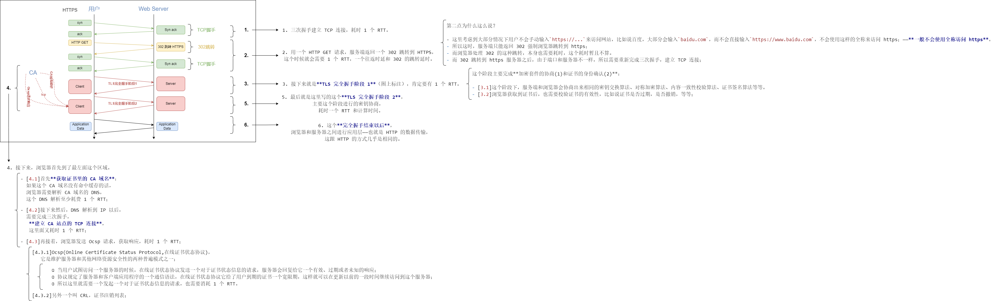

# 6-3 HTTPS 使用成本

- 证书费用以及更新维护
- HTTPS 降低用户访问速度
- 消耗 CPU 资源，需要增加大量机器

# 6-4 HTTPS 对性能的影响

不得不承认，HTTPS 在保护用户隐私，防止流量劫持方面，发挥着非常关键的作用。但是与此同时，就像上一节讨论的 HTTPS 成本时提到了一点，HTTPS 也会一定程度上降低用户的访问速度，增加网站服务器的计算资源消耗；到底会因为什么影响网站的性能呢？

## 1.影响性能——两个方面

我们说主要有两个方面：

- **协议交互所增加的网络 RTT**
- **加解密相关的计算耗时**

## 2.简单介绍

[1]一方面简单介绍 RTT：

- RTT(Round-Trip Time):往返时延。
- 在计算机网络中它是一个非常重要的性能指标，表示从发送端发送数据开始，到发送端收到来自接收端的确认（接收端收到数据后便立即发送确认），（在这个过程中）总共经过的时延。这也是影响网络访问速度的一个重要东西；这是一方面。

[2]另外一方面就是：

- 加解密相关的计算耗时；

从这两方面分别介绍一下。先来看一下 RTT 所带来的网络耗时。

## 3.RTT 网络耗时（一方面）

### 3.1 前言

- 我们**比较一下 HTTP 和 HTTPS 在网络访问和往返时延上的区别**，从而帮助我们更好的认识 HTTPS 对于我们性能的一些影响。

- 由于 HTTP 和 HTTPS **都需要** DNS 解析，并且大部分情况下都使用了 DNS 缓存；为了突出这样的对比效果，我们就**忽略主域名的 DNS 解析**时的样子。

### 3.2 HTTP

那我们来看看用户使用 **HTTP 协议访问网站时**的样子，会有像**图中网络上的一些交互延迟**，这也可以看出来：

1. ① 用户只需要完成 TCP 三次握手，建立 TCP 连接，
2. ② 就能够直接发送我们的 HTTP 请求，
3. ③ 获取应用层的数据。

因此呢，除此之外在访问过程中，也没有需要消耗这种计算资源的地方。

### 3.3 HTTPS

- 接下来我们来看 HTTPS 的访问过程，相对 HTTP 要**复杂很多**：

- 在**部分场景**下，使用 HTTPS 访问甚至有可能多增加**7 个 RTT，7 个往返时延**；

#### 3.3.1 看看这个步骤：

---

1. 三次握手建立 TCP 连接，耗时 1 个 RTT。

---

2. 用一个 HTTP GET 请求，服务端返回一个 302 跳转到 HTTPS，这个时候就会需要 1 个 RTT，一个往返时延和 302 的跳转延时。

第二点为什么这么说？

- 这里考虑到大部分情况下用户不会手动输入`https://...`来访问网站，比如说百度，大部分会输入`baidu.com`，而不会直接输入`https://www.baidu.com`，不会使用这样的全称来访问 https；——**一般不会使用全称访问 https**。
- 所以这时，服务端只能返回 302 强制浏览器跳转到 https；
- 而浏览器处理 302 的这种跳转，本身也需要耗时，这个耗时暂且不算。
- 而 302 跳转到 https 服务器之后，由于端口和服务器不一样，所以需要重新完成三次握手，建立 TCP 连接；

---

3. 接下来就是**TLS 完全握手阶段 1**（图上标注），肯定要有 1 个 RTT。

这个阶段主要完成**加密套件的协商(1)和证书的身份确认(2)**：

- [3.1]这个阶段下，服务端和浏览器会协商出来相同的密钥交换算法、对称加密算法、内容一致性校验算法、证书签名算法等等。

- [3.2]浏览器获取到证书后，也需要校验证书的有效性，比如说证书是否过期，是否撤销，等等；

---

4. 接下来，浏览器首先到了最左面这个区域。

- [4.1]首先**获取证书里的 CA 域名**：  
  如果这个 CA 域名没有命中缓存的话，  
  浏览器需要解析 CA 域名的 DNS，  
  这个 DNS 解析至少耗费 1 个 RTT；

- [4.2]接下来然后，DNS 解析到 IP 以后，  
  需要完成三次握手，  
   **建立 CA 站点的 TCP 连接**，  
   这里面又耗时 1 个 RTT；

- [4.3]再接着，浏览器发送 Ocsp 请求，获取响应，耗时 1 个 RTT；  
   [4.3.2]另外一个叫 CRL，证书注销列表；  
   [4.3.1]Ocsp(Online Certificate Status Protocol,在线证书状态协议)，  
   它是维护服务器和其他网络资源安全性的两种普遍模式之一；  
   ① 当用户试图访问一个服务器的时候，在线证书状态协议发送一个对于证书状态信息的请求，服务器会回复给它一个有效、过期或者未知的响应；  
   ② 协议规定了服务器和客户端应用程序的一个通信语法，在线证书状态协议它给了用户到期的证书一个宽限期，这样就可以在更新以前的一段时间继续访问到这个服务器；  
   ③ 所以这里就需要一个发起一个对于证书状态信息的请求，也需要消耗 1 个 RTT。

---

5. 最后就是这里写的这个**TLS 完全握手阶段 2**，  
   主要这个阶段进行的密钥协商，  
   耗时一个 RTT 和计算时间。

---

6. 这个**完全握手结束以后**，  
   浏览器和服务器之间进行应用层——也就是 HTTP 的数据传输，  
   这跟 HTTP 的方式几乎是相同的。

#### 3.3.2 总结：

[1]这样我们看到经过这么多步骤，**最多会耗费 7 个 RTT**。

- [1.1]当然不是说每个请求都要增加 7 个 RTT 才能完成 HTTPS 首次请求交互：

- [1.2]如果不是首次请求的话，如果在任何一个步骤，比如说像 CA 域名解析，有命中缓存的话，都能在一定程度上减少这个 RTT 的消耗；

[2]但是我们**可以确定的是**什么呢？

- **HTTPS 一定**在网络上的消耗，是要**略大于 HTTP** 的。

## 4.计算耗时（另一方面）

- 浏览器计算耗时
- 服务端计算耗时

刚刚只是描述了这个 HTTPS 关键路径上，必须消耗的纯网络耗时，没有包括非常消耗 CPU 资源的计算耗时；实际上，这个计算耗时，也不太小，大概会到 30ms 以上，也可以分为两个方面：

- 一方面是浏览器计算耗时；这里会包含：浏览器解析证书签名、各种密钥交换、应用层数据加解密，和这种一致性的交换。

- 另一方面就是服务端计算的耗时，也同样包含这种密钥交换、应用层数据加解密的耗时；由于客户端这种 CPU 和操作系统的种类比较多，所以计算耗时不能一概而论；那这两部分加在一起呢，就会在一定程度上影响到服务器的性能；

然后如果我们是一个大型网站的网络开发、运维人员，也一定需要对 HTTPS 的访问速度进行优化；这里边优化的知识其实它比较贴近于网络底层了，需要大家有很深入的知识体系；

我简单聊一下，就是一般的优化会包含：

- 比如我们常听过的叫做 TCP Fast Open；像 HSTS，还有 session assum、优先 ECC 加密、硬件加速等等；
- 这里我们不太展开了。需要大家对整个网络知识，包括 TCP、加密算法都有了很好很好的掌握，才能够 hold 住这些方面的优化；
- 实际上，这方面的优化，不仅仅是 HTTP 的优化，甚至我们说很少是 HTTP 的优化，更包含的就是 TCP、会话层等等这些的优化措施。

## 5.总结：

- OK，到这呢，我们确定了 HTTPS 确实可以保护 HTTP 的安全；
- 但是，由于具有一定的成本，又会在某种程度上略微影响性能，需要大量的优化措施，但是我们还是认为它是一个非常好的安全解决方案；

这样我们分成了几个方面，从一些**专业的角度上认识了 HTTPS**。

接下来我们从其他人这个行业圈子外面的人，从他们的角度想一下，对于 **HTTPS**，我们还会有什么样的**疑问**，或者有什么样的**误解**。
