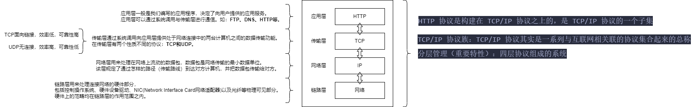
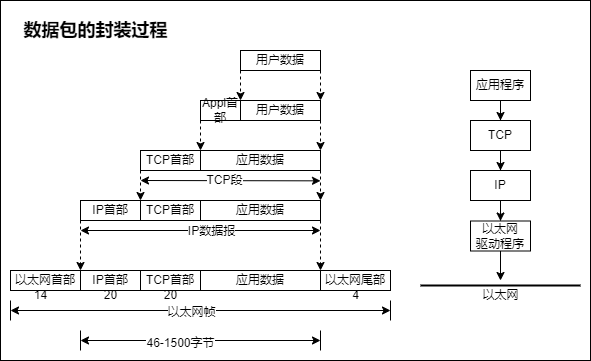
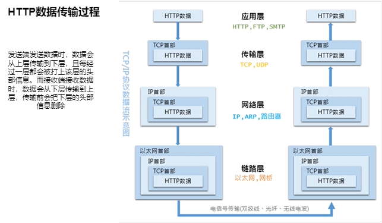
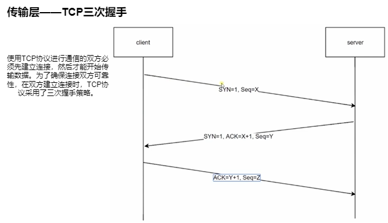
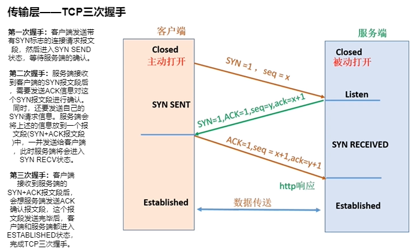

# 2-2 TCP/IP 协议概要

[返回学习笔记目录](/README.md)

HTTP 协议是构建在 TCP/IP 协议之上的，是 TCP/IP 协议的一个子集.

TCP/IP 协议族：TCP/IP 协议其实是一系列与互联网相关联的协议集合起来的总称.

## 1.分层管理（重要特性）——四层协议组成的系统：

- 应用层
- 传输层
- 网络层
- 数据链路层

### 1.1.应用层

- 应用层一般是我们编写的应用程序，决定了向用户提供的应用服务。
- 应用层可以通过系统调用与传输层进行通信。如：FTP、DNS、HTTP 等。

### 1.2.传输层

- 传输层通过系统调用向应用层提供处于网络连接中的两台计算机之间的数据传输功能。
- 在传输层有两个性质不同的协议：TCP 和 UDP。

### 1.3.网络层

- 网络层用来处理在网络上流动的数据包，数据包是网络传输的最小数据单位。
- 该层规定了通过怎样的路径（传输路线）到达对方计算机，并把数据包传输给对方。

### 1.4.数据链路层

- 链路层用来处理连接网络的硬件部分，包括控制操作系统、硬件设备驱动、NIC(Network Interface Card 网络适配器)以及光纤等物理可见部分。
- 硬件上的范畴均在链路层的作用范围之内。

## 2.数据包的封装过程

## 3.HTTP 数据传输过程

## 4.传输层——TCP 三次握手

使用 TCP 协议进行通信的双方必须先建立连接，然后才能开始传输数据。为了确保连接双方可靠性，在双方建立连接时，TCP 协议采用了三次握手策略。

1. **第一次握手**：客户端发送带有 SYN 标志的连接请求报文段，然后进入 SYN SEND 状态，等待服务端的确认。
2. **第二次握手**：服务端接收到客户端的 SYN 报文段后，需要发送 ACK 信息对这个 SYN 报文段进行确认。同时，还要发送自己的 SYN 请求信息。服务端会将上述的信息放到一个报文段(SYN+ACK 报文段)中，一并发送给客户端，此时服务端将会进入 SYN RECV 状态。
3. **第三次握手**：客户端接收到服务端的 SYN+ACK 报文段后，会想服务端发送 ACK 确认报文段，这个报文段发送完毕后，客户端和服务端都进入 ESTABLISHED 状态，完成 TCP 三次握手。

## 5.三次握手的目的是什么？

确认自己和对方的发送和接收能力都是正常的
